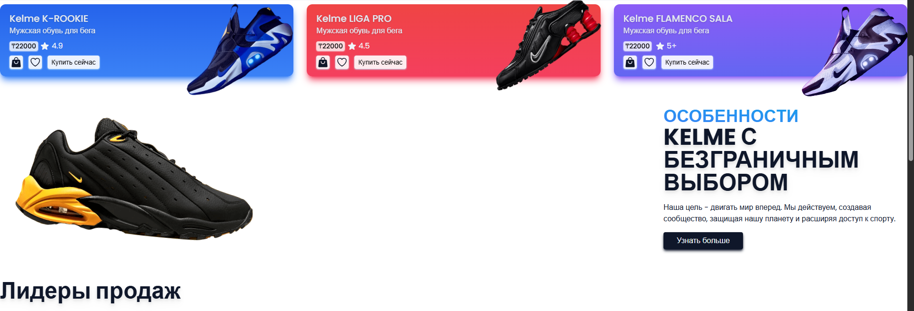
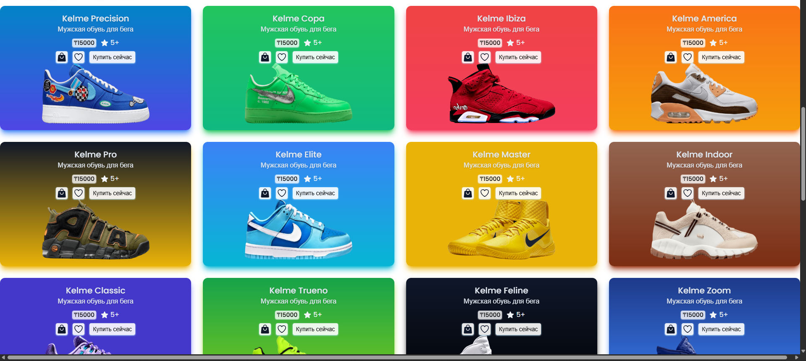
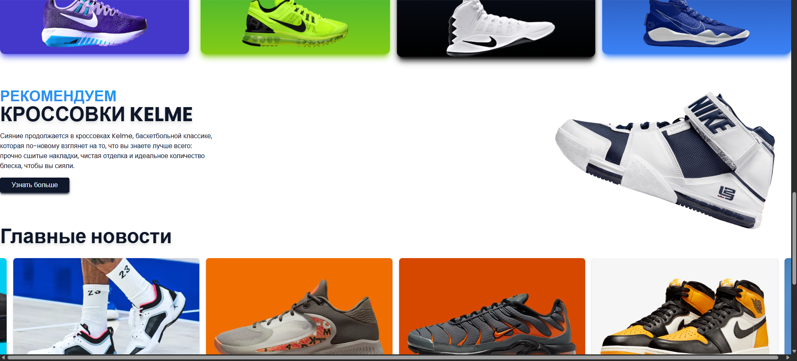
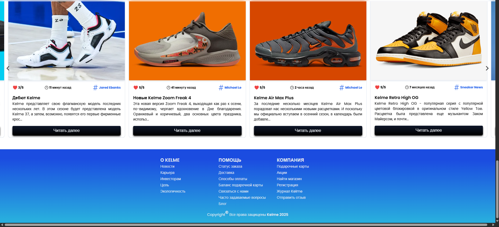

# Веб-приложение для электронной коммерции Kelme Store

Добро пожаловать в веб-приложение для электронной коммерции Kelme Store! Это современная платформа для онлайн-покупок, созданная с использованием передовых технологий для обеспечения удобного и приятного пользовательского опыта. Проект разработан на [Vite.js](https://vitejs.dev/) и стилизован с помощью [TailwindCSS](https://tailwindcss.com/).

## Демонстрация

Вы можете ознакомиться с работающей версией приложения по следующей ссылке: [Kelme Store Demo](https://aditya-nike-store.netlify.app/)

## Скриншоты







## Технологии

В этом проекте используются следующие технологии:

*   **[Vite.js](https://vitejs.dev/):** Быстрый и современный сборщик проектов, который использует нативные ES-модули.
*   **[React](https://reactjs.org/):** Библиотека для создания пользовательских интерфейсов.
*   **[TailwindCSS](https://tailwindcss.com/):** Утилитарный CSS-фреймворк для быстрой разработки пользовательских интерфейсов.
*   **[Redux Toolkit](https://redux-toolkit.js.org/):** Официальный, рекомендуемый набор инструментов для эффективной разработки с использованием Redux.
*   **[React-Redux](https://react-redux.js.org/):** Официальные привязки React для Redux для управления состоянием приложения.
*   **[React Router](https://reactrouter.com/):** Стандартная библиотека для маршрутизации в React.
*   **[React Hot Toast](https://react-hot-toast.com/):** Уведомления для React.
*   **[Heroicons](https://heroicons.com/):** Набор красивых иконок в формате SVG.

## Функционал

*   **Адаптивный дизайн:** Приложение полностью адаптивно и отлично выглядит на любых устройствах.
*   **Корзина:** Добавляйте товары в корзину, просматривайте их и оформляйте заказ.
*   **Список желаний:** Создавайте список желаний, чтобы не потерять понравившиеся товары.
*   **Поиск:** Удобный поиск по товарам с возможностью добавления в корзину и в избранное прямо из результатов поиска.
*   **Страницы товаров:** Подробная информация о каждом товаре.

## Начало работы

Чтобы запустить проект локально, выполните следующие шаги:

1.  **Клонируйте репозиторий:**

    ```bash
    git clone https://github.com/your-username/kelme-store.git
    cd kelme-store
    ```

2.  **Установите зависимости:**

    ```bash
    npm install
    ```

3.  **Запустите сервер для разработки:**

    ```bash
    npm run dev
    ```

    Теперь вы можете открыть [http://localhost:5173](http://localhost:5173) в вашем браузере.

## Структура проекта

```
.
├── public/
├── src/
│   ├── app/
│   │   ├── CartSlice.js
│   │   ├── LikeSlice.js
│   │   ├── SearchSlice.js
│   │   └── Store.js
│   ├── assets/
│   ├── components/
│   │   ├── cart/
│   │   ├── like/
│   │   ├── utils/
│   │   ├── Cart.jsx
│   │   ├── FlexContent.jsx
│   │   ├── Footer.jsx
│   │   ├── Hero.jsx
│   │   ├── Like.jsx
│   │   ├── Navbar.jsx
│   │   ├── Sales.jsx
│   │   ├── Search.jsx
│   │   └── Stories.jsx
│   ├── context/
│   ├── data/
│   ├── App.jsx
│   ├── index.css
│   └── main.jsx
├── .gitignore
├── index.html
├── package.json
├── README.md
└── ...
```

## Вклад в проект

Мы приветствуем любой вклад в развитие проекта! Если вы хотите помочь, пожалуйста, сделайте форк репозитория и создайте pull request.

---

Спасибо за интерес к нашему проекту! Мы надеемся, что вам понравится работать с ним. 🛍️✨
